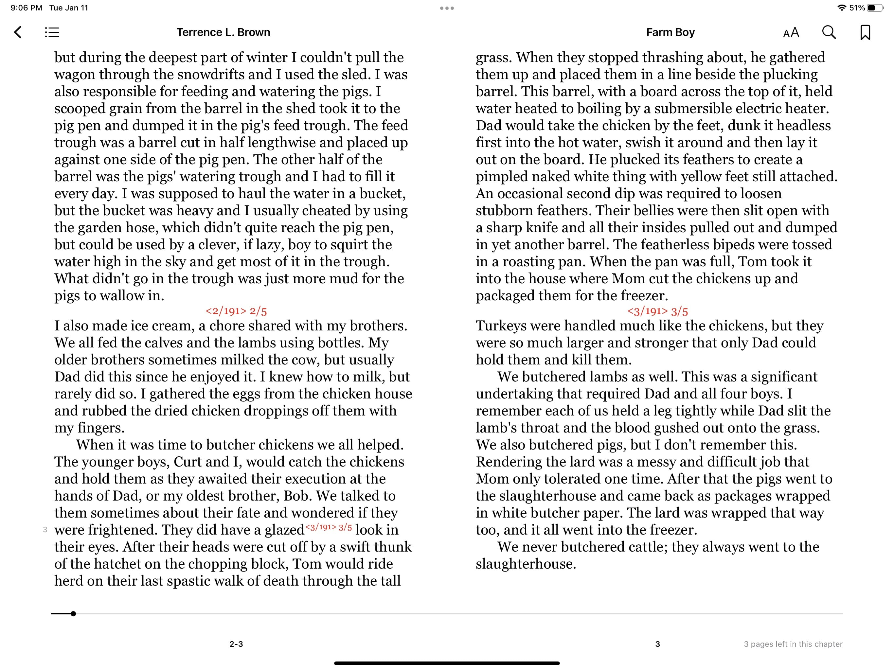
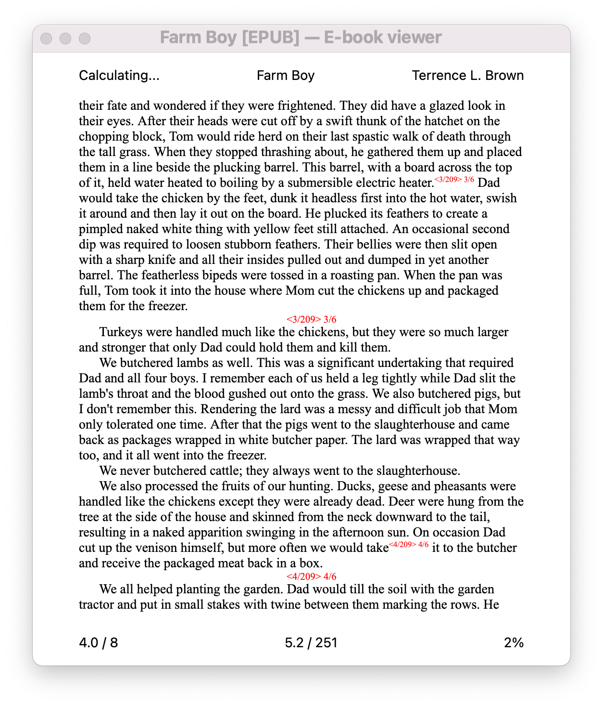

# epub\_paginator

epub\_paginator is a Python script that generates pagination for ePub2
and ePub3 books. For ePub3 books, it can generate embedded pagination
that applications like Adobe Digital Editions, or Apple Books honor and
display properly. For ePub2 or ePub3 books, it can embed formatted
lines (called pagelines) in the text with pagination information both
for the entire book as well as chapter progress. It can also generate
pagination information formatted as superscripts in the text.

## Features

* For ePub3 files, epub\_paginator can generate a page-list table in the
  navigation document, and page links in the epub text.
* epub\_paginator can generate page information lines in text of an ePub2
  or ePub3 document. These are placed at the end of the paragraph where
  the page break occurs and appear like separate paragraphs in the book.
* epub\_paginator can generate superscripted page information lines in
  text of an ePub2 or ePub3 document. These are placed at the word where
  the page break occurs.
* If an ePub3 document has existing pagination, epub\_paginator can match
  the existing pagination with pagelines or superscripts.
* Font size, color and alignment (right, left, or center) are
  selectable for pagelines.
* Font size and color are selectable for superscripts.
* Total pages may optionally be included in pagelines and superscripts
  for both the book and the current chapter.
* For ebooks without existing pagination, the page size may be defined
  by specifying words per page, or by specifying total pages for the
  book in which case words per page is:

> (words per page) = (words in the book) / (total pages).

## Installation

## Usage

```
epub\_paginator --help

usage: epub\_paginator.py [-h] [-c CFG] [--outdir OUTDIR]
                         [--match | --no-match] [--genplist | --no-genplist]
                         [--pgwords PGWORDS] [--pages PAGES]
                         [--pageline| --no-pageline] [--pl_align PL_ALIGN]
                         [--pl_color {red,blue,green,none}]
                         [--pl_bkt {<,(,none}] [--pl_fntsz PL_FNTSZ]
                         [--pl_pgtot | --no-pl_pgtot]
                         [--superscript | --no-superscript]
                         [--super_color {red,blue,green,none}]
                         [--super_fntsz SUPER_FNTSZ]
                         [--super_total | --no-super_total]
                         [--chap_pgtot | --no-chap_pgtot]
                         [--chap_bkt CHAP_BKT] [--epubcheck EPUBCHECK]
                         [--chk_orig | --no-chk_orig]
                         [--ebookconvert EBOOKCONVERT] [--DEBUG | --no-DEBUG]
                         ePub_file

Paginate ePub file.

positional arguments:
  ePub_file             The ePub file to be paginated.

optional arguments:
  -h, --help            show this help message and exit
  -c CFG, --cfg CFG     path to configuration file
  --outdir OUTDIR       location for output ePub files
  --match, --no-match   If pagination exists, match it. (default: True)
  --genplist, --no-genplist
                        generate the navigation page list and page links for
                        page numbers (default: True)
  --pgwords PGWORDS     define words per page; if 0, use pages
  --pages PAGES         if = 0 use pgwords; else pgwords=(wordcount/pages)
  --pageline, --no-pageline
                        generate and insert pagelines into the ePub text
                        (default: False)
  --pl_align PL_ALIGN   'right', 'left' or 'center'; specify alignment of the
                        pageline
  --pl_color {red,blue,green,none}
                        html color for the inserted pageline
  --pl_bkt {<,(,none}   character to use to bracket page number
  --pl_fntsz PL_FNTSZ   font size as percentage of book font for the
  pageline
  --pl_pgtot, --no-pl_pgtot
                        include total pages in the pageline (default: False)
  --superscript, --no-superscript
                        generate superscripted page numbers (default: False)
  --super_color {red,blue,green,none}
                        html color for the inserted page pageline e.g. 'red'
  --super_fntsz SUPER_FNTSZ
                        font size as percentage of book font for the
                        pageline 
  --super_total, --no-super_total
                        include total pages in the pageline (default: False)
  --chap_pgtot, --no-chap_pgtot
                        include chapter page and total in the pageline and/or
                        superscript (default: True)
  --chap_bkt CHAP_BKT   '<', '(' or nothing; character to use to bracket page
                        number
  --epubcheck EPUBCHECK
                        location of epubcheck executable
  --chk_orig, --no-chk_orig
                        Run epubcheck on original file (default: True)
  --ebookconvert EBOOKCONVERT
                        location of ebook conversion executable
  --DEBUG, --no-DEBUG   print additional debug information to the log file
                        (default: False)
```

``` bash
    epub\_paginator --options epub_file
```
epub\_paginator is a command-line tool that can be configured with
command line options, or by referencing a configuration file. The
configuration file is in json format. An example configuration file
"epub_pager.cfg" is provided: 

``` json
{
    "outdir": "/Your/path/for/epubs",
    "match": true,
    "genplist": true,
    "pgwords": 300,
    "pages": 0,
    "pageline": true,
    "pl_align": "center",
    "pl_color": "red",
    "pl_bkt": "<",
    "pl_fntsz": "75%",
    "pl_pgtot": true,
    "superscript": false,
    "super_color": "red",
    "super_fntsz": "60%",
    "super_total": false,
    "chap_pgtot": true,
    "chap_bkt": "",
    "ebookconvert": "None",
    "chk_orig": true,
    "epubcheck": "none",
    "DEBUG": false
}
```

### Epub Reader Support

Most epub readers do not support epub3 page-lists. 

#### Adobe Digital Editions

On macOS Adobe Digital Editions reads page-list information and creates
a listing of page numbers as links. Click a link and jump to the page
number. This is the only support provided. 

#### Apple Books

As far as I am aware, only Apple Books supports using the epub3
page-list element in a useful manner. However, I am not familiar with
current Android epub readers. If some Android readers provide support
for epub3 pagination, please let me know.

Apple Books uses epub3 pagination as an option. You must select "Tap to
show print edition page numbers' at the bottom of the Table of Contents
for epub3 pagination to be used. If the ebook does not contain a
page-list element in the navigation file, this option will not be
displayed. 

When print edition page numbers is enabled, the page numbering in the
displayed pageline reflects the page as specified in the page-list. In
addition, Books will display the page number in the margin beside the
location where the actual page break occurs (this could be in the middle
of a paragraph). 

Apple Books can be inconsistent in its handling of page numbers. In
books with existing pagination, Books is sometimes does not display all
page numbers in the margin. In other cases margin page numbers are not
displayed at all. In some books page numbers are displayed in the Books
footer, but you cannot search for them by page number. It's a mess.

In books paginated by epub\_paginator, occasionally Books will not
display some page numbers in the margin, although the pagination in the
displayed Books footer is consistent. Books does properly
search for page numbers in books paginated by epub\_paginator.

#### Other epub Readers Without epub3 Pagination Support

Since most epub readers do not support displaying epub3 page-list
information, epub\_paginator provides two alternatives for custom
pagination.

##### Pagelines

The 'pagelines' option directs epub\_paginator to place formatted lines
containing pagination information in the text. These pagelines are
placed at the end of the paragraph in which the page break occurred.

##### Superscripts

The 'superscript' option directs epub\_paginator to place page
information in the text of the book as a superscript placed after the
word where the page break occurs. 

The following image is the Calibre ebook-viewer app display a page of a
book paginated with epub\_paginator. The superscript page information is in
the second line of the displayed page. The superscript is placed just
after the word at which the page break occurred. The pageline is placed
at the end of the paragraph in which the page break occurred. In each
case, both current page and page totals for the book and the chapter are
presented.

Note that Calibre ebook-viewer does not display information from the
page-list of this ebook.






### The Details

epub\_paginator creates a copy of the input epub file and operates on the
copy. Although epub\_paginator should not corrupt, delete, or otherwise
modify the original epub file, always back up your files! epub\_paginator
requires epub files without DRM (Digital Rights Management) to operate.
It outputs the modified file to the directory specified in 'outdir' with
'\_paged' appended to the file name.

#### Determining the Page Length

If epub\_paginator detects an existing page-list element in the
navigation file of the epub (this can only occur when the epub file is
version 3), 'genplist' is forced to false. epub\_paginator does not
overwrite or modify an existing page-list and will not generate a second
page-list if one exists.

If 'match' is set and a page-list element is found, then pagination for
pagelines and/or superscripts is matched to the existing pagination.

If 'genplist' or 'pagelines' or 'super' are enabled and no existing page-list
element is found, the pagination will be based on the values of the
options 'pgwords' and 'pages' as follows:

1. If 'pgwords' and 'pages' are zero, this is a fatal error. epub\_paginator has
   no way to determine where to place pages.
2. If 'pgwords' is not zero, its value is used to determine the page length for
   the paginated book.
3. if 'pgwords' is zero and 'pages' is not zero, then 'pgwords' is set to the
   integer value of (the book wordcount) / (pages) and 'pgwords' is used to
   determine the page length for the paginated book.

##### Examples


### epubcheck Usage

[epubcheck  ](https://www.w3.org/publishing/epubcheck/docs/getting-started/)
may be used to check the original epub and the paginated epub for errors. Set
the --epubcheck configuration option to the path of your version of epubcheck.
If you want the original epub file to be checked, also set --chk_orig.

#### epubcheck Comments

1. epubcheck is slow compared to epub\_paginator. epub\_paginator will
   generally take much less than a second to paginate an epub file.
   epubcheck, even on the smallest files, will usually take two or more
   seconds. 
2. Many epub files, particularly older files, will cause epubcheck to
   generate multiple errors, often dozens or even hundreds of errors.
   epub\_paginator simply reports these errors and whether there was a
   difference in the number of warnings, errors, or fatal errors between
   the check of the original book and the paginated book. 
3. Fortunately, most epub readers are very forgiving of warnings, errors
   and fatal errors reported by epubcheck. While it is common for
   epubcheck to report errors and fatal errors, it is relatively
   uncommon for epub readers to improperly render the epub book. 
4. The most common errors that occur in epub\_paginator formatted books
   that are not present in the original book have to do with pagelines
   being placed in locations were epubcheck does not allow them. I have
   not seen any of these errors cause issues in the epub readers I have
   tested. 

### epub_converter Usage

[Calibre](https://calibre-ebook.com) provides a command-line ebook converter
program, ebook-convert, which epub\_paginator can use to convert epub2 books to
epub3 books to allow page-list generation. If the option "ebookconvert"
contains the path to ebook-convert, epub2 books will be converted to
epub3 and the epub3 book will be paginated.

### Debugging


